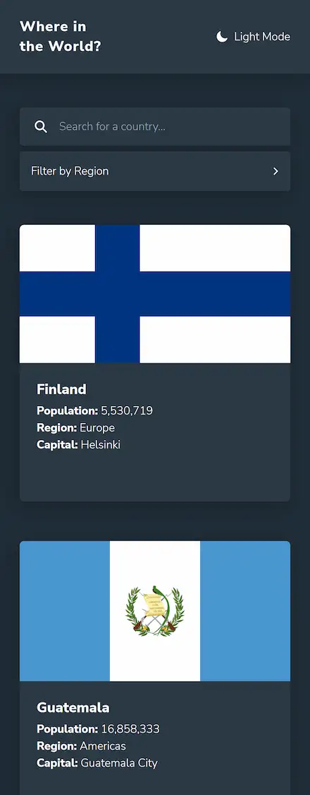
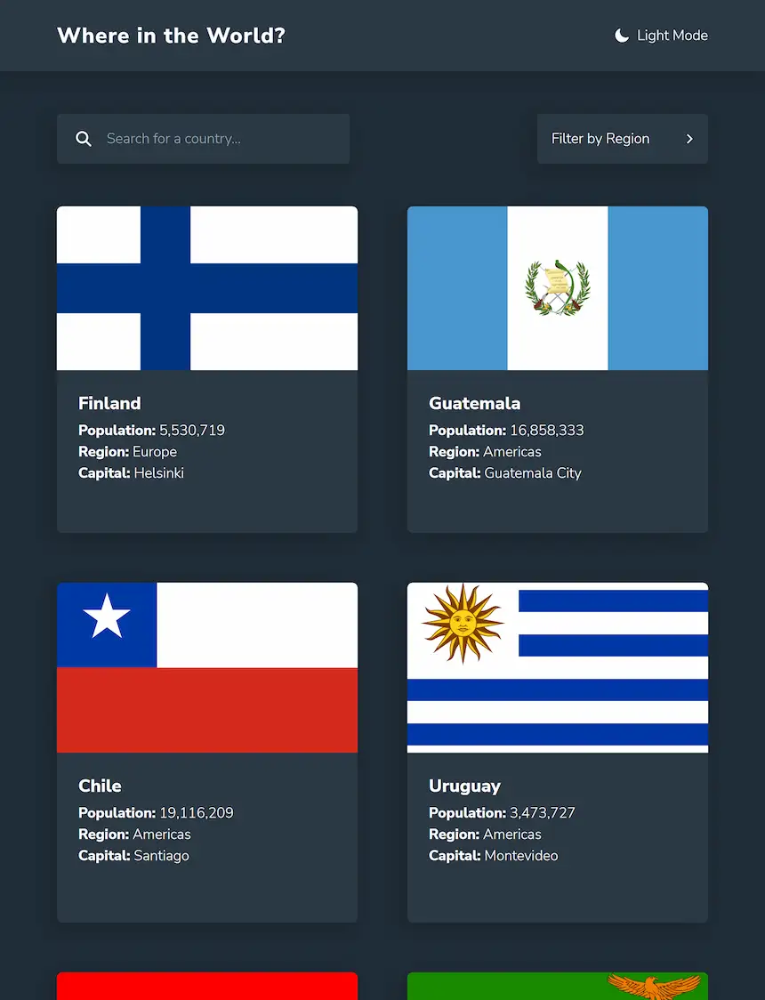
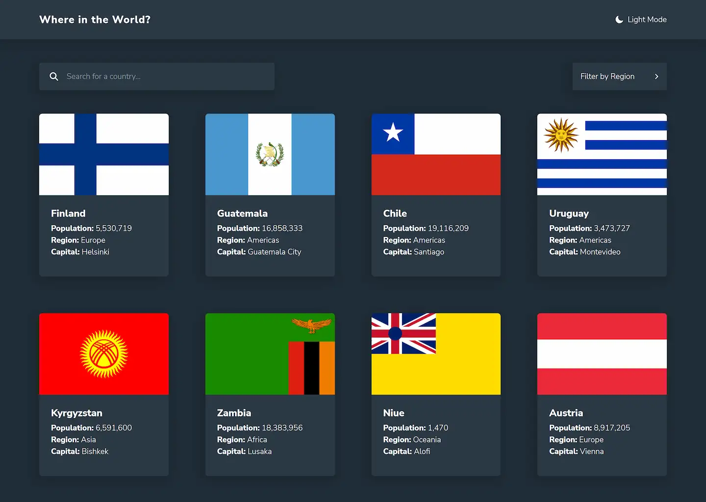

<a href="mailto:cosmohydra17@gmail.com"></img></a>

# Where in the World?

A website that allows you to search information about countries. This is a solution to the [REST Countries API with color theme switcher challenge on Frontend Mentor](https://www.frontendmentor.io/challenges/rest-countries-api-with-color-theme-switcher-5cacc469fec04111f7b848ca). Made with the [Rest Countries API](https://restcountries.com)

[Solution][solution-url] . [Live Page][live-page]

Table of contents

-   [Overview](#overview)
    -   [The challenge](#the-challenge)
    -   [Screenshots](#screenshots)
    -   [Links](#links)
-   [My process](#my-process)
    -   [Built with](#built-with)
    -   [What I learned](#what-i-learned)
-   [Author](#author)

## Overview

### The challenge

Users should be able to:

-   See all countries from the API on the homepage
-   Search for a country using an `input` field
-   Filter countries by region
-   Click on a country to see more detailed information on a separate page
-   Toggle the color scheme between light and dark mode

Additional features:

-   URL path handling
-   Back to top button
-   Dark mode detection and saving themes to localStorage

### Screenshots

<table>
        <tr>
		    <td>
                
            </td>
			            <td>
                
            </td>
            <td>
                
            </td>
        </tr>
</table>

### Links

-   [Solution][solution-url]
-   [Live Page][live-page]

## My process

### Built with

-   Flexbox
-   CSS Grid
-   [React](https://reactjs.org/)
-   [Vite](https://vitejs.dev)
-   [TailwindCSS](https://tailwindcss.com)
-   [Rest Countries API](https://restcountries.com)

<a href="#top">⬆️ Back to top</a>

### What I learned

This challenge was a great learning opportunity. I worked on different topics that helped me improve my knowledge of technologies such as React, Tailwind, Fetch and of course JS.

I also added some new features like the theme switch button or the path handling, for the latter I initially thought to use React Router but due to some changes of ideas React Router was no longer necessary so I decided to do the path handling with vanilla JS.

<a href="#top">⬆️ Back to top</a>

## Author

-   Instagram - [@cosmo_art0](https://www.instagram.com/cosmo_art0/)
-   Twitter - [@CosmoArt0](https://twitter.com/cosmoart0)
-   Frontend Mentor - [@CosmoArt](https://www.frontendmentor.io/profile/cosmoart)
-   Website - [cosmoart.vercel.app](https://cosmoart.vercel.app)

<a href="#top">⬆️ Back to top</a>

[live-page]: https://where-world.vercel.app
[solution-url]: https://www.frontendmentor.io/solutions/where-in-the-world-solution-_B3wLmeKnR
